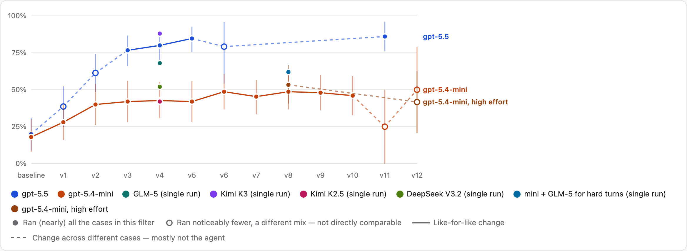

# Where Is It — voice home inventory

A phone-friendly web app (PWA) for remembering where things are in your home.
Say *"the extension cords are in the blue bin on the top garage shelf"*, and
later ask *"where are the extension cords?"*. You can also type.

## How it works

```
Phone (PWA: speech → text)  ──▶  Cloudflare Worker  /api/*
                                   │  passkeys (access password to create an account) → session cookie
                          AuthDO — global account directory: people + their passkeys
                                   ▼
                          HouseDO — one Durable Object (own SQLite DB) per account
                            ├─ inbox        layer 1: every utterance verbatim + the agent's reading of it
                            ├─ house tables layer 2: rooms → storage → items, details, relationships, history
                            ├─ traces       full trace of every conversation and tidy-up (served as JSON files)
                            └─ agents       converse (per utterance) · compact (tidy-up)
```

- **A model decides what to store.** Each utterance is saved to the inbox *first*,
  then the conversation agent reads it and does one or more of the following:
  - records structured observations (place, move, remove, lend, describe a storage spot, detail, relate, correct)
  - answers a question by searching the house
  - asks you a clarifying question when the answer would change what gets stored
- **Compaction.** The agent periodically folds pending inbox entries into the
  relational tables. This runs within 6 hours of new entries, within seconds once
  20 are waiting, or when you tap *Tidy up now* on the House screen. Anything it
  can't file safely becomes a question for you rather than a guess.
- **Readable data.** On the Files screen you can view or download:
  - `inbox.jsonl`
  - `questions.json`
  - `house.md` (an outline)
  - `house.json` (a tree)
  - `house.sql` (the whole database; `sqlite3 house.db < house.sql`)
  - every trace

  You can also download all of it as one zip.
- **Model-agnostic.** The agents use a small provider interface
  (`server/llm/`). Configure the model in `wrangler.jsonc` vars or secrets, with
  no code changes:

  | Setting | Meaning |
  |---|---|
  | `LLM_PROVIDER` | `openai` (any OpenAI-compatible API) or `anthropic` |
  | `LLM_MODEL` | Model id. Defaults: `gpt-5.5` / `claude-opus-5-5` |
  | `LLM_BASE_URL` | Optional, for other OpenAI-compatible hosts: Ollama (`http://localhost:11434/v1`), OpenRouter, Gemini, vLLM, … |
  | `OPENAI_API_KEY` / `ANTHROPIC_API_KEY` / `LLM_API_KEY` | API key. `LLM_API_KEY` overrides the vendor-specific ones. |

- **Sign-in uses passkeys**, so there's no third-party account.
  - **Creating an account** needs the owner-held access password (`ACCESS_PASSWORD`)
    and a name. The phone then saves a passkey with Face ID or Touch ID.
  - **After that**, you sign in with the passkey alone.
  - **Other devices:** passkeys sync across your own Apple or Google devices.
    For a different device or browser, use Settings → *Add a passkey on this device*
    while signed in.
- **Offline.** Utterances made without a connection are queued on the phone and
  sent when it reconnects.

## Evals

The agent is tested by a capture eval: scripted conversations run against the real agents with a simulated
person answering their questions, graded by code. **[Results, charts and what we've learned →](evals/RESULTS.md)**
(how it works: [`evals/capture/README.md`](evals/capture/README.md)).



## Develop

```bash
npm install
cp .env.example .env   # fill in ACCESS_PASSWORD, SESSION_SECRET, a model key; DEV_AUTH=1 for password-only local sign-in
npm run dev            # PWA + Worker + Durable Objects, all local, at http://localhost:5173
npm test               # server logic tests (node:sqlite + a scripted fake model; no network)
npm run build
```

## Deploy (Cloudflare)

One-time setup:

Set the secrets. Each command prompts for its value:
   ```bash
   npx wrangler secret put ACCESS_PASSWORD
   npx wrangler secret put SESSION_SECRET     # e.g. output of: openssl rand -hex 32
   npx wrangler secret put OPENAI_API_KEY     # or ANTHROPIC_API_KEY
   ```

Then deploy with `npm run deploy`. On the phone, open the URL in Safari and use **Share → Add to Home Screen**.

> On iPhone, voice *capture* needs internet, because Safari sends the audio to Apple
> for transcription. For better spoken answers, download an Enhanced or Premium
> voice under Settings → Accessibility → Spoken Content → Voices; the app picks
> it up automatically.

## Layout

```
server/
  index.ts          Worker entry: sends /api/* to the route table, everything else to the PWA
  http.ts           response helpers + the route shape
  routes/auth.ts    sign-in routes (passkeys, access password, logout)
  routes/house.ts   a signed-in person's house: converse, house view, tidy-up, file downloads
  auth.ts           access password check, session cookies
  auth-do.ts        account directory + passkey (WebAuthn) registration and sign-in
  house-do.ts       per-account Durable Object: inbox capture, agents, compaction scheduling
  db/schema.ts      the SQLite schema (both layers), documented inline
  db/house.ts       HouseDb: db.inbox / db.questions / db.locations / db.items, plus search and the house map
  db/inbox.ts       layer 1: what was said, and the agent's questions
  db/locations.ts   layer 2: the tree of places (room → storage → container)
  db/items.ts       layer 2: things, their details, relationships and move history
  db/sql.ts         thin typed wrapper over SQLite; the only code that runs SQL
  db/export.ts      inbox.jsonl / house.md / house.json / house.sql
  agent/prompts.ts  system prompts (the speech → data decision guide lives here)
  agent/converse.ts conversation agent + its tools
  agent/compact.ts  tidy-up agent + its tools
  agent/schema.ts   helpers for writing tool input schemas
  agent/loop.ts     provider-neutral tool-use loop that produces traces
  llm/              provider interface + Anthropic and OpenAI-compatible adapters
  trace.ts          conversation/compaction traces (stored per turn, served as files)
src/
  App.tsx           mic loop, conversation transcript, clarifying-question chips
  components/       SignIn, Captured (what was recorded), HouseTree, Files, Settings
  lib/api.ts        API client + offline outbox
  lib/passkeys.ts   browser side of passkey sign-up / sign-in
  lib/speech.ts     Web Speech API: pause-tolerant dictation + spoken replies
```
