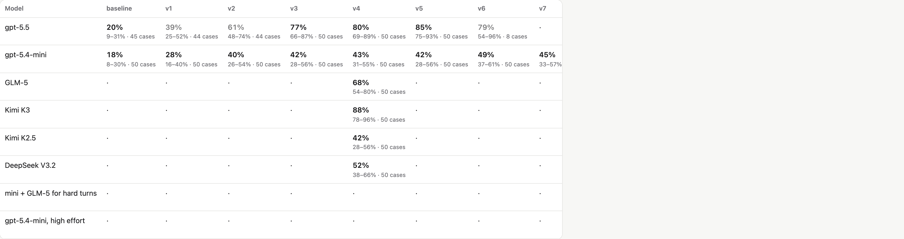
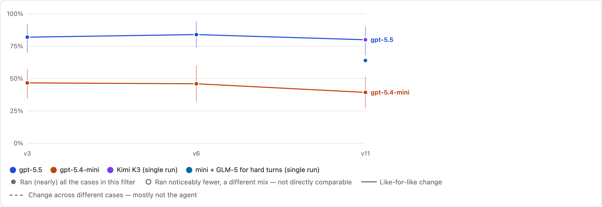
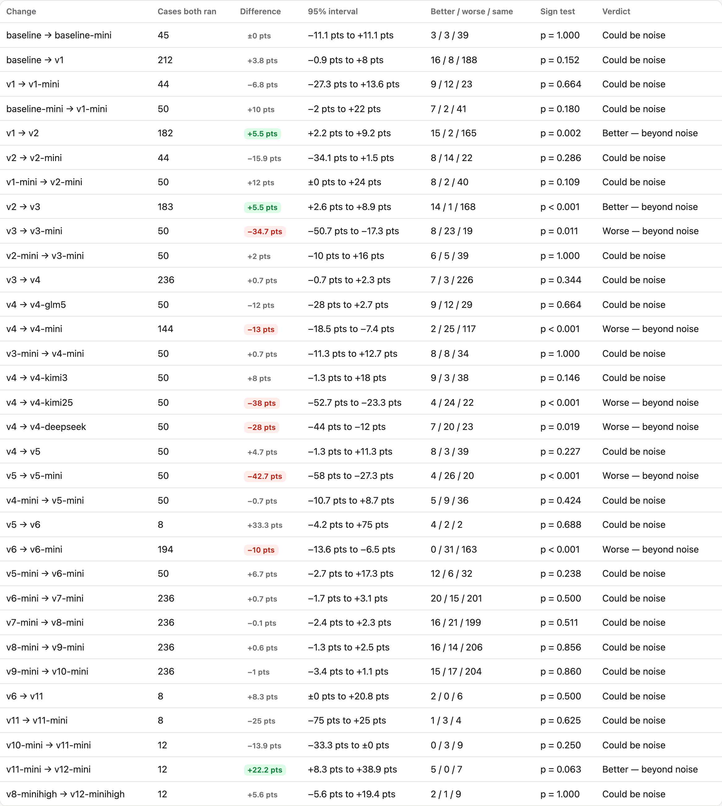

# Where Is It — eval results

How well the agent behind Where Is It files what people say, asks when it should, and answers
"where is it?" — across versions of its prompts and tools, and across models. Numbers are from runs on
4–6 October 2026. How the eval works, and every command, is in [`capture/README.md`](capture/README.md).

> The interactive version of these charts (filters, every case, failure causes) is
> `.claude/hillclimb/capture/compare.html`, built by `npm run eval:charts`, which also refreshes the images here.

## What's measured

Each case runs the app's real conversation and tidy-up agents against a throwaway house database. When the
agent asks a question, a simulated person (gpt-5.4-mini, answering only from facts the case gives it)
replies. Code then checks the final database and the spoken replies — no model grades another model.

| Kind | Cases | Purpose |
|---|---:|---|
| **Dev** — sets A–K | 236 | What we iterate against. Split into a **capability** suite (50 cases that still tell versions apart) and a **regression** suite (186 every version passes — the deploy gate). |
| **Robustness** | 130 | Dev cases said worse: speech-to-text noise, fillers, chit-chat. Same facts, so the score shouldn't move. |
| **Held-out test** | 93 | Never iterated against. 50 of them are **hard** — the capability suite's kind of case, in its proportions. |

## Each model across versions — capability suite (50 cases)

- **gpt-5.5 climbed fast to v3 (20% → 77%), then flattened** at about 80–86%: v5 → v11 is +1.3 points
  (−8.7 to +11.3), well within noise.
- **gpt-5.4-mini climbed to v2 (18% → 40%), then flattened** at about 42–49%. The first three prompt
  versions (asking when unsure, positions, position words) are where nearly all the gains came from, for
  both models.
- Hollow points ran only part of the suite (e.g. v11/v12 on mini ran only the group cases), so they
  aren't comparable with the filled ones.

## Held-out, hard (50 cases)

| Setup | Pass rate | Cost per case |
|---|---:|---:|
| gpt-5.5, v3 | 82% | $0.116 |
| gpt-5.5, v6 (live) | 84% | $0.140 |
| gpt-5.5, v11 | 80% | $0.111 |
| Kimi K3 (Bedrock), v11 | 80% | $0.142 |
| gpt-5.4-mini + GLM-5 for hard turns, v11 | 64% | $0.043 |
| gpt-5.4-mini, v3 | 47% (3 runs/case) | $0.012 |
| gpt-5.4-mini, v11 | 39% (3 runs/case) | $0.010 |

- **No version since v3 is better on cases it was never tuned on.** gpt-5.5 is flat (82 → 84 → 80);
  mini drifts down (v3 → v11: −7.3 points, −17 to +2, not significant). The dev gains after v3 mostly
  fixed the specific dev cases they targeted — the overfitting a held-out set exists to catch.
- **The hard core is shared.** Of gpt-5.5's 10 failures at v11, mini also fails 8 and Kimi K3 fails 5.
  Reading them: 3 were the simulated person answering against its facts (now labelled as such), 2 hinge on
  a product choice (should it offer to itemise "the cleaning supplies" every time?), and 5 are genuine —
  not asking which look-alike unit is which, and not offering to list a group.

## Comparing versions honestly

Versions are compared **case by case on the cases both ran**, with a 95% bootstrap interval over cases
and a sign test. Only v1 → v2 and v2 → v3 are improvements beyond noise; most later changes "could be
noise". pass^3 (the chance three runs of a case *all* pass) is reported alongside the average, because a
memory app has to be reliable, not occasionally right.

## Models and cost (capability suite, v4 agent)

| Model | Pass rate | Cost per case | vs gpt-5.4-mini (paired) |
|---|---:|---:|---|
| Kimi K3 | 88% | $0.135 | +45 pts, beyond noise |
| gpt-5.5 | 80% | $0.126 | +37 pts, beyond noise |
| GLM-5 | 68% | $0.049 | +25 pts, beyond noise |
| DeepSeek V3.2 | 52% | $0.076 | could be noise |
| gpt-5.4-mini | 43% | $0.012 | — |
| Kimi K2.5 | 42% | $0.021 | same |

Typical time per spoken reply: ~2–4 s on gpt-5.4-mini, ~7–10 s on gpt-5.5, longer on Kimi K3.

## Learning track: making a small model better (gpt-5.4-mini, 236 dev cases × 3 runs)

| Change | Quality vs before (paired) | Cost per case | Lesson |
|---|---|---:|---|
| v7 — tell the agent when a box is filed as a plain item | +0.7 pts, noise | $0.009 | Diagnosed from two transcripts; counting across all cases showed it was a minority failure. |
| v8 — `file_stack` / `reorder_stack` tools | flat overall; stacks 11/36 → 17/36 runs | $0.009 | Tools that make the right structure easy fixed structure — not reasoning about order. |
| Think harder (high effort) | +1.3 pts, noise | $0.012 | Not worth 33% more. |
| Escalate hard turns + tidy-up to GLM-5 | **+6.4 pts, beyond noise** | ~$0.03–0.05 | The one clear win — but 7 points behind gpt-5.5 on held-out cases. |
| v9 — agent reviews its own changes before finishing | +0.6 pts, noise | $0.015 | Mini doesn't catch its own mistakes. Dropped. |
| v10 — concise prompt (~4,850 → ~2,770 tokens) | same quality | 22% fewer input tokens | Kept; saves more on bigger models. |
| v12 — restore group guidance cut in v10 | groups 16/36 → 24/36 runs | — | Trimming examples quietly cost the small model a behavior it only half had. |

## Bugs the evals found

- **A cycle in the place tree** — merging a place into one inside it made it its own parent; later, filing
  a box inside itself did the same. Each froze a run at 100% CPU (found by sampling the stuck process).
  Both fixed, and every tree walk now stops at a cycle.
- **Bedrock rejected garbled tool names** replayed from earlier turns — fixed by replaying them under a
  placeholder.

## Further reading

- [Demystifying evals for AI agents](https://anthropic.com/engineering/demystifying-evals-for-ai-agents) — Anthropic: code graders, simulated users, capability vs regression suites, pass@k vs pass^k.
- [Adding Error Bars to Evals](https://arxiv.org/abs/2411.00640) — Evan Miller: clustered intervals and paired comparisons.
- [τ-bench](https://arxiv.org/abs/2406.12045) — Yao et al.: pass^k for agents talking to a simulated user.
- [Beyond Accuracy: Behavioral Testing of NLP Models with CheckList](https://arxiv.org/abs/2005.04118) — Ribeiro et al.: invariance tests (our robustness set).
- [A Careful Examination of LLM Performance on Grade School Arithmetic](https://arxiv.org/abs/2405.00332) — Zhang et al.: what a fresh held-out set reveals.
- [Your AI Product Needs Evals](https://hamel.dev/blog/posts/evals/) and [A Field Guide to Rapidly Improving AI Products](https://hamel.dev/blog/posts/field-guide/) — Hamel Husain: error analysis in practice.
- [Who Validates the Validators?](https://arxiv.org/abs/2404.12272) — Shankar et al.: aligning model-based graders with people.
